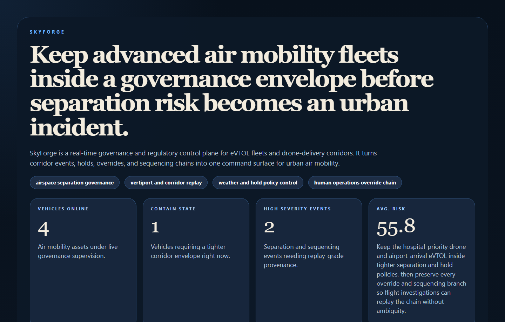
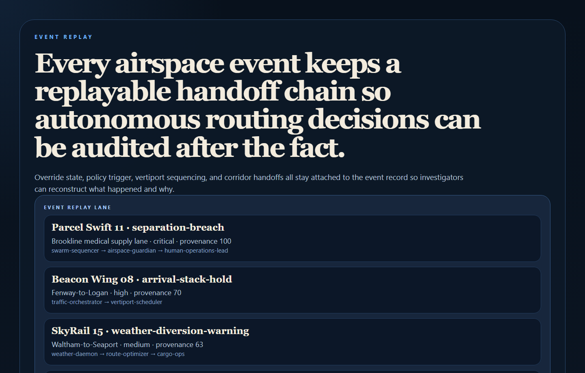
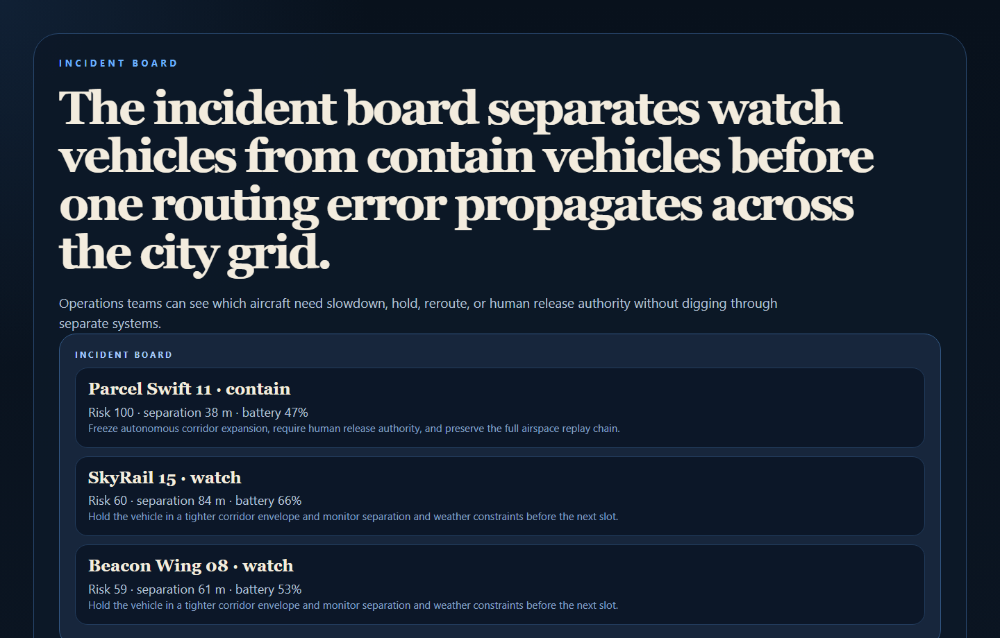
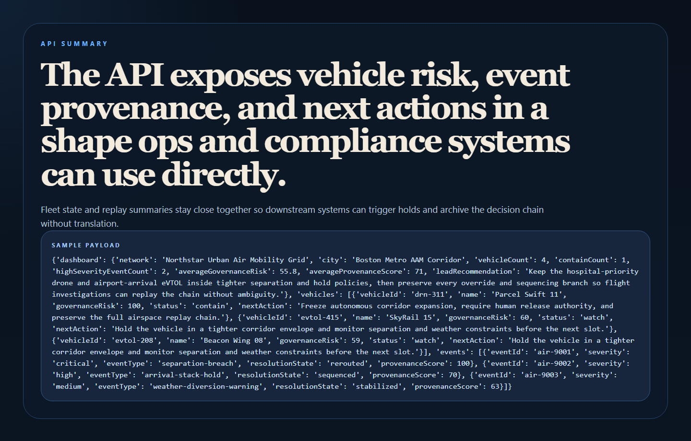

# SkyForge

SkyForge is a real-time swarm governance and regulatory control plane for eVTOL fleets, drone delivery, and urban air mobility operations.



## Why this repo is good

- It tackles a real future operations problem: autonomous air corridors need governance, replayable provenance, and human override authority.
- It keeps the story concrete with separation breaches, arrival holds, weather diversions, and corridor policy envelopes.
- It gives you another flagship that feels futuristic but still operationally believable.

## What it does

- Scores air mobility vehicles for governance risk using separation distance, battery state, wind margin, override readiness, and event history.
- Tracks airspace events with policy triggers, handoff chains, and provenance scores.
- Separates clear, watch, and contain states for operations supervision.
- Exposes a clean API plus operator-facing proof surfaces for airspace command, event replay, and incident review.

## Proof





## Local run

```powershell
Set-Location "C:\Users\chaus\dev\repos\skyforge"
py -3.11 -m venv .venv
.\.venv\Scripts\pip.exe install -r requirements.txt
.\.venv\Scripts\python.exe -m app.main
```

Open:

- `http://127.0.0.1:4862/`
- `http://127.0.0.1:4862/event-replay`
- `http://127.0.0.1:4862/incident-board`
- `http://127.0.0.1:4862/docs`

## Validation

```powershell
.\.venv\Scripts\python.exe -m unittest discover -s tests
.\.venv\Scripts\python.exe scripts\run_demo.py
.\.venv\Scripts\python.exe scripts\smoke_check.py
.\.venv\Scripts\python.exe scripts\render_readme_assets.py
```

## API shape

Endpoints:

- `/api/dashboard/summary`
- `/api/vehicles`
- `/api/events`
- `/api/vehicles/{vehicle_id}`
- `/api/events/{event_id}`
- `/api/sample`

## Repo layout

```text
app/
  data/
  services/
docs/
scripts/
screenshots/
tests/
```
